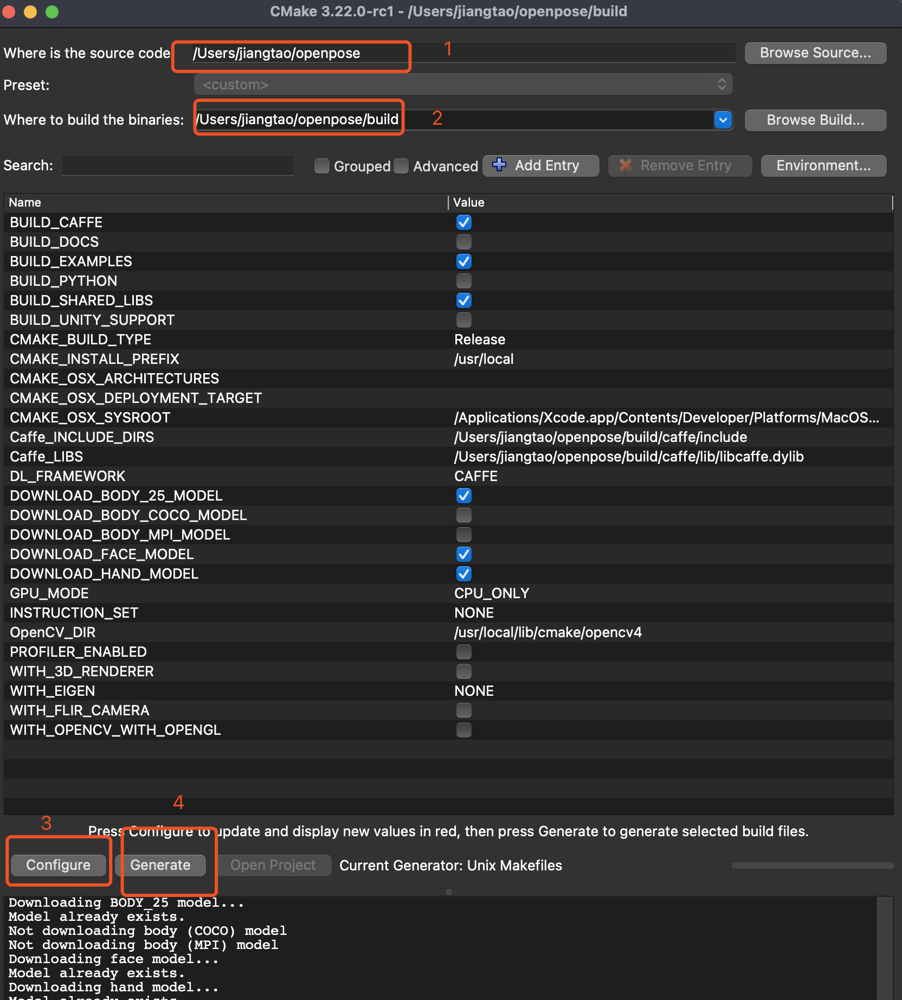

下载代码
git clone https://github.com/CMU-Perceptual-Computing-Lab/openpose
下载子包
git submodule update --init --recursive --remote
git submodule update --init --recursive

进入openpose后做下面所有操作
cd openpose

下载mac下系统所需包（使用brew ）
./scripts/osx/install_deps.sh

下载cmake所需modules
./models/getModels.sh

打开cmake软件
brew install --cask cmake

创建一个build目录

打开cmake

进入build进行编译

cd build
make -j`sysctl -n hw.logicalcpu`

测试使用（mac下打开很慢，需要几十秒，甚至几分钟）
测试video
./build/examples/openpose/openpose.bin --video examples/media/video.avi

测试image
./build/examples/openpose/openpose.bin --image_dir examples/media/test/ --face --hand --write_json output_jsons/ --write_images output_images/

参考：
https://cmu-perceptual-computing-lab.github.io/openpose/web/html/doc/md_doc_installation_0_index.html